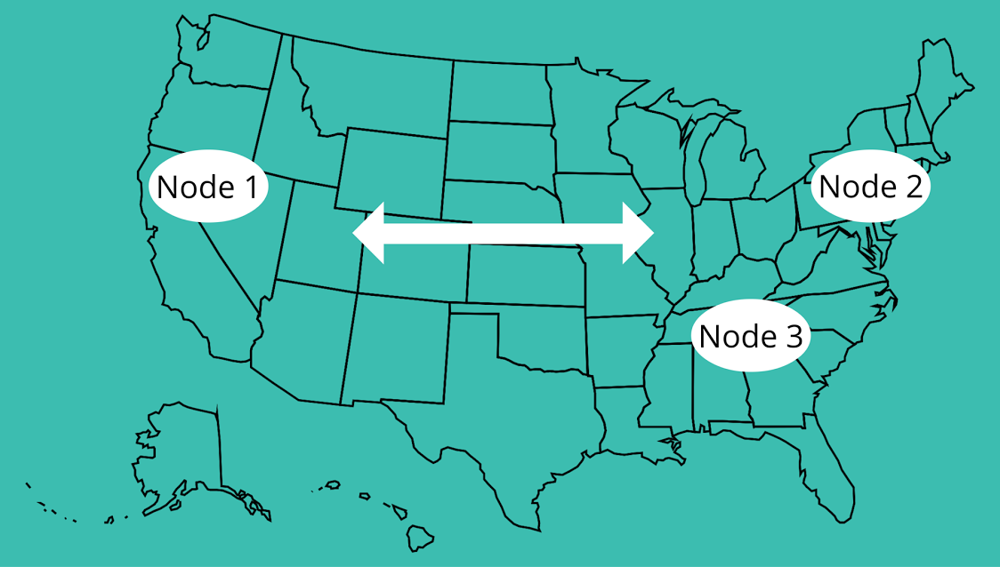

# Terminology - Cont'd #

* Shards is a unit of storage and operation assigned to a node to distribute index across nodes in a cluster - to allow horizontal scalability
* Replication supports high availability as in case of a node failure and improves scalability by allowing search operations on replicas
* Clustering across multiple data centers, i.e. higher network latency and lower bandwidth - not supported
